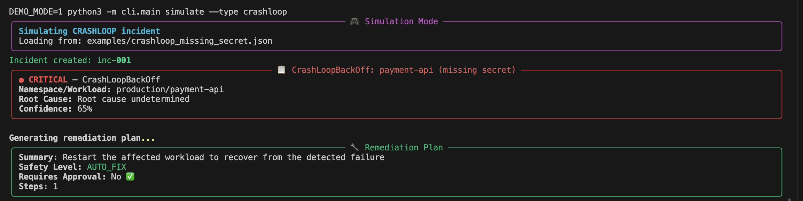
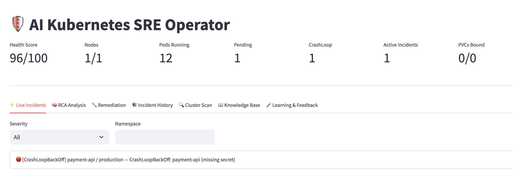
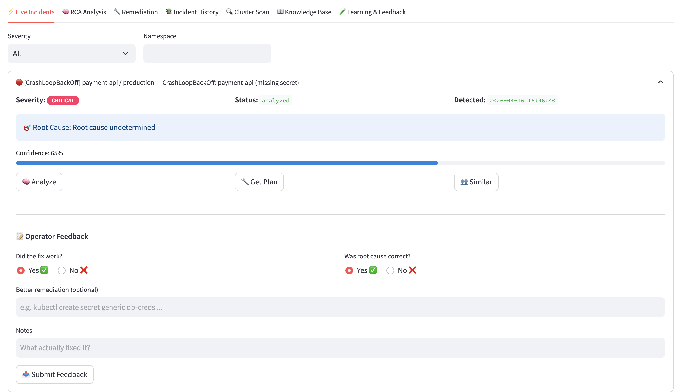
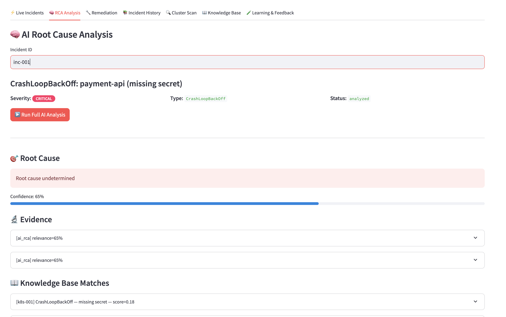
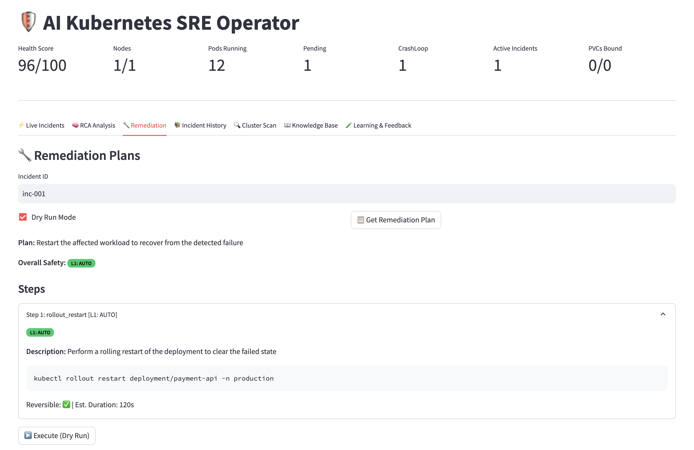
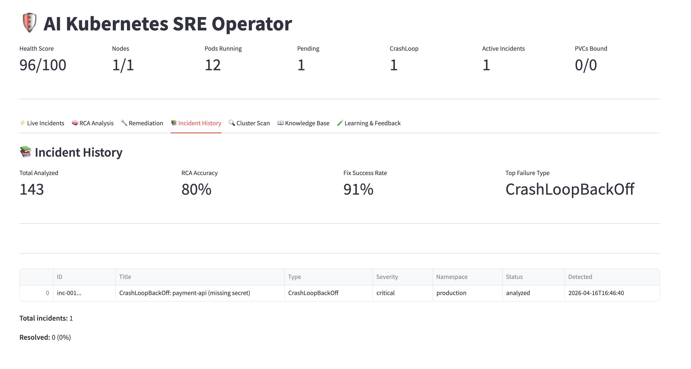
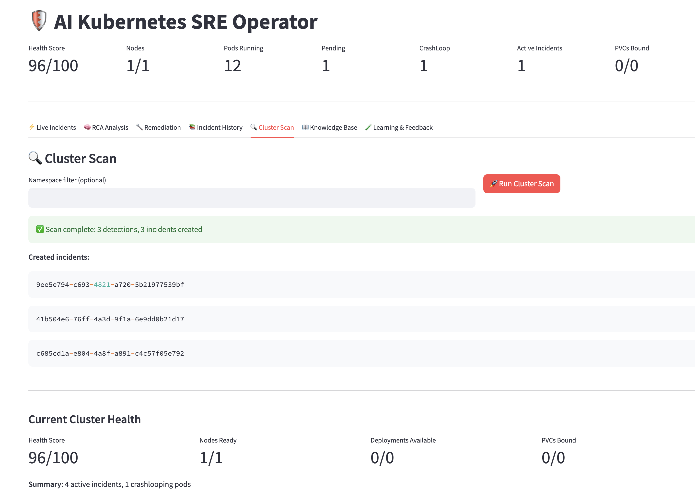

# AI K8s SRE Operator

> **Unified AI-powered Kubernetes SRE + Application Performance Monitoring platform.**
> Detects infrastructure failures, monitors application health, explains root cause, suggests remediation, and learns from every incident — all in one tool.

[](https://python.org)
[](https://fastapi.tiangolo.com)
[](https://kubernetes.io)
[](#testing)
[](#detectors)
[](#knowledge-base)
[](LICENSE)
[](docs/platforms.md)
[](docs/platforms.md)
[](docs/platforms.md)

---

## What Is This?

This tool combines two traditionally separate observability disciplines into a single, AI-driven platform:

| Capability | Description |
|---|---|
| **K8s SRE Automation** | Detects cluster-level failures (crashloops, OOMKills, probe failures, PVC issues, node pressure, RBAC, networking) — similar to what a senior SRE would notice manually |
| **Application Performance Monitoring** | A lightweight sidecar agent runs inside your pods and monitors application logs, error rates, response times, exception patterns, and slow queries — similar to AppDynamics or Dynatrace |
| **AI Root Cause Analysis** | Both infrastructure and application signals are unified and fed into an AI reasoning engine that explains *why* something broke, not just *that* it broke |
| **Self-Learning** | Every incident and operator feedback trains the system. It learns your application's specific error patterns over time |
| **Safe Automated Remediation** | 3-tier safety system (auto-fix / approval-required / suggest-only) with dry-run mode, namespace policies, and cooldowns |

Works across **EKS, AKS, GKE, and self-hosted/local clusters**. Runs fully **offline in demo mode** — no API key, no cluster required.

---

## Screenshots

| Dashboard | Incident Analysis | APM Overview |
|---|---|---|
|  |  |  |

| Remediation Plan | Knowledge Base | Learning Stats |
|---|---|---|
|  |  |  |

| Cluster Summary | | |
|---|---|---|
|  | | |

> **Take screenshots:** Run `make run-ui` then `make simulate` to populate the dashboard with live incidents, then capture the 7 tabs. Save as `Screenshots/<name>.png`. See [Screenshots/README.md](Screenshots/README.md) for the full guide.

---

## Quick Start

```bash
git clone https://github.com/anil-114912/ai-k8s-sre-operator
cd ai-k8s-sre-operator
pip install -r requirements.txt
cp .env.example .env
```

### Option A — Demo mode (no cluster, no API key)

```bash
# Fully offline, simulated cluster with baked-in incidents
DEMO_MODE=1 make run-api    # Terminal 1
make run-ui                  # Terminal 2 → http://localhost:8501
make simulate                # Terminal 3 — inject demo incidents
```

### Option B — Real cluster (no AI key needed)

```bash
# Connects to your current kubectl context
make run-api                 # Terminal 1
make run-ui                  # Terminal 2
```

### Option C — Real cluster + AI analysis

```bash
# Edit .env: set ANTHROPIC_API_KEY=sk-ant-... or OPENAI_API_KEY=sk-...
make run-api
make run-ui
```

### Option D — In-cluster via Helm

```bash
# Add cloud provider context for enhanced cloud-native patterns
helm install ai-sre-operator ./helm/ai-k8s-sre-operator \
  --set cluster.provider=aws \          # aws | azure | gcp | generic
  --set llm.apiKey=$ANTHROPIC_API_KEY \
  --set persistence.storageClass=gp3    # your cluster's storage class
```

---

## Architecture

### Full System Pipeline

```
┌─────────────────────────────────────────────────────────────────────────────┐
│                           Kubernetes Cluster                                │
│                                                                             │
│  ┌──────────────────────────────────────────────────────────────────────┐  │
│  │  APPLICATION PODS (with optional sidecar agent)                      │  │
│  │                                                                      │  │
│  │   ┌─────────────────┐    ┌──────────────────────────────────────┐   │  │
│  │   │  Your App       │    │  AI SRE Sidecar Agent                │   │  │
│  │   │  Container      │───▶│  • Tails stdout/stderr logs          │   │  │
│  │   │                 │    │  • Detects exceptions, 5xx, slow reqs│   │  │
│  │   │                 │    │  • Reports to Operator API (30s)     │   │  │
│  │   └─────────────────┘    │  • Learns app-specific patterns      │   │  │
│  │                          └──────────────┬───────────────────────┘   │  │
│  └────────────────────────────────────────│──────────────────────────────┘  │
│                                           │                                 │
│  ┌────────────────────────────────────────▼──────────────────────────────┐  │
│  │  OPERATOR CORE                                                        │  │
│  │                                                                       │  │
│  │  ┌──────────────┐    ┌───────────────────────────────────────────┐   │  │
│  │  │  K8s Watch   │───▶│  Infrastructure Detectors (18)            │   │  │
│  │  │  Loop (30s)  │    │  CrashLoop · OOM · ImagePull · Pending   │   │  │
│  │  └──────────────┘    │  Probe · Service · Ingress · PVC · HPA  │   │  │
│  │                      │  DNS · RBAC · NetPolicy · CNI · Mesh     │   │  │
│  │  ┌──────────────┐    │  NodePressure · Quota · Rollout · Storage│   │  │
│  │  │  APM Ingest  │───▶└──────────────────┬────────────────────────┘   │  │
│  │  │  (from agent)│                       │                             │  │
│  │  └──────────────┘                       ▼                             │  │
│  │                       ┌────────────────────────────────────────────┐  │  │
│  │  ┌──────────────┐     │  Signal Correlator                         │  │  │
│  │  │  Collectors  │────▶│  root_cause · symptom · contributing      │  │  │
│  │  │  Logs/Events │     │  Timeline Builder · Incident Graph         │  │  │
│  │  │  Metrics/APM │     └──────────────────┬─────────────────────────┘  │  │
│  │  └──────────────┘                        │                             │  │
│  │                                          ▼                             │  │
│  │  ┌──────────────┐    ┌────────────────────────────────────────────┐   │  │
│  │  │  Knowledge   │───▶│  AI RCA Engine                             │   │  │
│  │  │  Base (53)   │    │  KB matches · past incidents · app patterns│   │  │
│  │  │  + Incident  │    │  Anthropic / OpenAI / rule-based fallback  │   │  │
│  │  │    Memory    │    └──────────────────┬─────────────────────────┘   │  │
│  │  │  + Feedback  │                       │                              │  │
│  │  └──────────────┘                       ▼                              │  │
│  │                       ┌────────────────────────────────────────────┐   │  │
│  │                       │  Remediation Controller                     │   │  │
│  │                       │  L1: auto_fix · L2: approval · L3: suggest │   │  │
│  │                       │  Namespace policy · Cooldown · Dry-run     │   │  │
│  │                       └──────────────────┬─────────────────────────┘   │  │
│  │                                          │                              │  │
│  │                       ┌──────────────────▼─────────────────────────┐   │  │
│  │                       │  Learning Store                             │   │  │
│  │                       │  Error capture · Refit · Promote · Adjust  │   │  │
│  │                       │  App pattern training · Feedback boost     │   │  │
│  │                       └────────────────────────────────────────────┘   │  │
│  └────────────────────────────────────────────────────────────────────────┘  │
└─────────────────────────────────────────────────────────────────────────────┘
         ▲                    ▲                        ▲
    FastAPI REST          Streamlit UI            Click CLI
    (port 8000)          (port 8501)          (ai-sre ...)
```

### APM Signal Flow

```
Pod Logs (stdout/stderr)
    │
    ▼
Sidecar Agent (log_tailer.py)
    │
    ├── error_detector.py ──▶ Exceptions, stacktraces, HTTP 5xx, slow queries
    ├── metrics_reporter.py ─▶ Error rate, latency p50/p95/p99, throughput
    └── pattern_learner.py ─▶ App-specific patterns learned over time
    │
    ▼  HTTP POST /api/v1/apm/ingest (every 30s)
    │
Operator API
    │
    ├── APM Aggregator ──▶ Service health scores, error trends
    ├── Signal Correlator ─▶ Links app errors to K8s events
    └── AI RCA Engine ────▶ Unified root cause (infra + app layer)
```

---

## Features

### Infrastructure Monitoring (SRE)

| Feature | Details |
|---|---|
| **18 Failure Detectors** | CrashLoopBackOff, OOMKill, ImagePull, PendingPod, ProbeFailure, Service, Ingress, PVC, HPA, DNS, RBAC, NetworkPolicy, CNI, ServiceMesh, NodePressure, Quota, Rollout, Storage |
| **54 KB Patterns** | Generic K8s (12) + EKS (6) + AKS (5) + GKE (5) + Networking (8) + Storage (6) + Security (5) + Cluster (4) + Application (3) |
| **Cloud Provider Awareness** | Auto-detects EKS/AKS/GKE from node labels; boosts relevant patterns |
| **Signal Correlation** | Root cause vs symptom vs contributing factor classification |
| **Multi-cloud Support** | EKS (Fargate, IRSA, ENI, add-ons) · AKS (VMSS, Workload Identity, webhook) · GKE (NAP, Binary Auth, Workload Identity) |

### Application Performance Monitoring (APM)

| Feature | Details |
|---|---|
| **Sidecar Agent** | Lightweight Python agent that runs alongside your app container, requires zero code changes |
| **Log Intelligence** | Tails stdout/stderr, detects exceptions, stacktraces, HTTP error codes, slow operations, connection failures |
| **Application Patterns** | Pre-built patterns for 20+ common application failure signatures (DB connection pool, memory leaks, deadlocks, etc.) |
| **Service Health Scores** | Per-service error rate, latency P50/P95/P99, throughput, and health score (0–100) |
| **Error Trend Analysis** | Tracks error frequency over time; detects spikes and regressions |
| **APM + SRE Correlation** | Links application errors to infrastructure events (e.g., DB connection failures ↔ network policy change) |

### AI & Learning

| Feature | Details |
|---|---|
| **Multi-provider LLM** | Anthropic Claude, OpenAI GPT, or fully offline rule-based fallback |
| **RAG-powered RCA** | Retrieves similar past incidents + KB patterns as context for the LLM |
| **Feedback Loop** | Operator marks fixes as working/not working; system adjusts confidence scores |
| **Pattern Promotion** | Learned patterns with repeated successful fixes get promoted to the KB |
| **App Log Training** | Sidecar agent captures novel application error signatures; feeds into the learning store |
| **Embeddings** | TF-IDF + sentence-transformers (all-MiniLM-L6-v2) for semantic similarity |

### Remediation & Safety

| Feature | Details |
|---|---|
| **3-tier Safety** | L1: auto-execute safe actions · L2: require approval · L3: suggest only |
| **Dry-run Mode** | Always default; never mutates cluster without explicit opt-in |
| **Namespace Policies** | Deny list (kube-system, kube-public) + optional allow list |
| **Cooldown Tracking** | Prevents repeated remediation of the same workload within 5 minutes |
| **6 Remediations** | Pod restart · Rollout restart · Scale deployment · Rollback · Resource patch · Job rerun |

---

## APM Sidecar Agent

The sidecar agent requires **zero code changes** to your application. Add it to any pod with a single annotation:

```yaml
apiVersion: apps/v1
kind: Deployment
metadata:
  name: my-app
spec:
  template:
    metadata:
      annotations:
        ai-sre-operator/inject-agent: "true"    # auto-inject via webhook (coming soon)
    spec:
      containers:
        - name: my-app
          image: my-app:latest

        # Or add the sidecar manually:
        - name: ai-sre-agent
          image: ghcr.io/anil-114912/ai-k8s-sre-agent:latest
          env:
            - name: OPERATOR_API_URL
              value: http://ai-sre-operator.ai-sre.svc:8000
            - name: POD_NAME
              valueFrom:
                fieldRef:
                  fieldPath: metadata.name
            - name: POD_NAMESPACE
              valueFrom:
                fieldRef:
                  fieldPath: metadata.namespace
            - name: SERVICE_NAME
              value: my-app
          resources:
            requests:
              cpu: 10m
              memory: 32Mi
            limits:
              cpu: 50m
              memory: 64Mi
          volumeMounts:
            - name: varlog
              mountPath: /var/log
              readOnly: true
      volumes:
        - name: varlog
          emptyDir: {}
```

The agent automatically detects:
- Python exceptions and tracebacks
- Java/Go/Node.js stack traces
- HTTP 4xx/5xx error rates
- Slow database queries (> 1s)
- Connection pool exhaustion
- Memory leak signatures
- Panic / fatal errors

See [docs/sidecar-agent.md](docs/sidecar-agent.md) for full configuration.

---

## Knowledge Base

54 failure patterns across 9 categories:

| Category | Patterns | Examples |
|---|---|---|
| Generic K8s | 12 | CrashLoop (6 causes), OOMKill, ImagePull, PVC mount, DNS, RBAC |
| EKS (AWS) | 6 | ENI exhaustion, IRSA, node group capacity, add-on version, Fargate profile, API throttling |
| AKS (Azure) | 5 | VM quota, Managed Identity, Disk attach, VMSS degraded, Workload Identity webhook |
| GKE (Google) | 5 | Workload Identity, Autopilot quota, Filestore mount, NAP provisioning, Binary Authorization |
| Networking | 8 | CoreDNS, NetworkPolicy, CNI, service mesh (Istio/Linkerd), ingress |
| Storage | 6 | PVC binding, CSI driver, StorageClass missing, ReadWriteOnce conflict |
| Security | 5 | RBAC forbidden, RBAC SA missing, Pod Security Admission, Seccomp, image signing |
| Cluster | 4 | Node pressure, quota, resource limits, etcd |
| Application | 3 | DB connection pool, HTTP error spike, memory leak |

All patterns are human-readable YAML in [knowledge/failures/](knowledge/failures/). You can add custom patterns without modifying any Python code.

---

## Comparison

| Feature | This Tool | AppDynamics | Datadog | PagerDuty |
|---|---|---|---|---|
| Kubernetes SRE automation | ✅ | ⚠️ limited | ⚠️ limited | ❌ |
| Application performance monitoring | ✅ sidecar | ✅ agent | ✅ agent | ❌ |
| AI root cause analysis | ✅ LLM+RAG | ✅ ML | ✅ ML | ⚠️ basic |
| Automated remediation | ✅ 3-tier safe | ❌ | ⚠️ limited | ❌ |
| Self-learning from feedback | ✅ | ❌ | ❌ | ❌ |
| Custom failure patterns | ✅ YAML | ❌ | ❌ | ❌ |
| Runs fully offline | ✅ demo mode | ❌ | ❌ | ❌ |
| Open source | ✅ MIT | ❌ | ❌ | ❌ |
| Cloud-specific KB (EKS/AKS/GKE) | ✅ | ❌ | ⚠️ | ❌ |
| Zero-code APM instrumentation | ✅ sidecar | ❌ requires SDK | ❌ requires SDK | ❌ |

---

## At a Glance

| Component | Count |
|---|---|
| Infrastructure detectors | 18 |
| Knowledge base patterns | 54 |
| Application failure patterns | 20+ (sidecar agent) |
| Incident types | 19 |
| Safety action mappings | 25 |
| API endpoints | 29 |
| Dashboard tabs | 8 |
| Tests | 202 |
| Supported cloud providers | 4 (EKS, AKS, GKE, generic) |
| Supported log frameworks | Python, Java, Go, Node.js, Rails |

---

## Documentation

| Document | Description |
|---|---|
| [Architecture](docs/architecture.md) | System design, pipeline layers, full project structure |
| [Application Monitoring](docs/application-monitoring.md) | APM guide — service health, error tracking, sidecar setup |
| [Sidecar Agent](docs/sidecar-agent.md) | Agent installation, configuration, pattern customisation |
| [Detectors](docs/detectors.md) | All 18 infrastructure detectors |
| [Knowledge Base](docs/knowledge-base.md) | 53 failure patterns, YAML format, search engine |
| [Learning and Feedback](docs/learning.md) | Feedback loop, error capture, pattern promotion, refit |
| [Safety Model](docs/safety.md) | 3-tier safety levels, guardrails, namespace policies |
| [API Reference](docs/api.md) | All REST endpoints including APM ingest endpoints |
| [CLI Reference](docs/cli.md) | All CLI commands |
| [Dashboard](docs/dashboard.md) | 8 UI tabs — incidents, APM, KB, learning, settings |
| [Configuration](docs/configuration.md) | Environment variables, Helm values, agent config |
| [Deployment](docs/deployment.md) | Docker, Helm, production hardening |
| [Testing](docs/testing.md) | 202 tests, integration tests, coverage |
| [Supported Platforms](docs/platforms.md) | EKS, AKS, GKE, Cilium, Istio, CSI drivers |
| [Roadmap](docs/roadmap.md) | Planned features across 4 phases |
| [Screenshots Guide](Screenshots/README.md) | How to capture and contribute screenshots |

---

## Roadmap

See [docs/roadmap.md](docs/roadmap.md) for the full roadmap. Summary:

**Phase 1 — Foundation (current):** Infrastructure SRE automation, 18 detectors, 53 KB patterns, AI RCA, safe remediation, multi-cloud support, feedback learning.

**Phase 2 — APM (in progress):** Sidecar agent, application log intelligence, service health scores, APM + SRE signal correlation, auto-injection webhook.

**Phase 3 — Advanced AI:** Fine-tuned models on incident history, anomaly detection (time-series), proactive failure prediction, natural language incident query.

**Phase 4 — Enterprise:** Multi-cluster federation, RBAC for the operator itself, SSO/OIDC, audit trail, Slack/PagerDuty/Jira integration, SLO tracking.

---

## Testing

```bash
# Full test suite
make test

# With coverage
DEMO_MODE=1 python3 -m pytest tests/ -v --cov=. --cov-report=html

# Integration test (requires Kind)
kind create cluster --name sre-test
python3 -m pytest tests/integration/ -v
```

202 passing tests across detectors, knowledge base, API, correlation, policies, remediations, feedback loop, and AI engine.

---

## Contributing

1. Fork the repo and create a feature branch
2. Add tests for any new detector or KB pattern
3. Run `make lint` and `make test` before pushing
4. Submit a PR — describe what failure scenario your change handles

To add a custom failure pattern, create a YAML file in `knowledge/failures/` — no Python required. See [docs/knowledge-base.md](docs/knowledge-base.md) for the pattern schema.

---

## License

MIT — Copyright 2025 Anil Thotakura. See [LICENSE](LICENSE).
